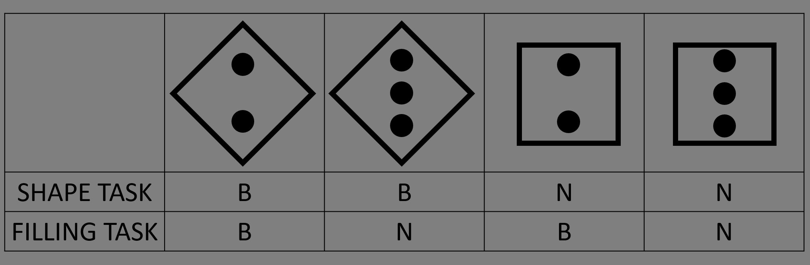

# Multi-tasking Experiment 

This repository contains the code necessary to perform a multitasking experiment, as described in the Experiment 1 of the paper 'Are women better than men at multi-tasking?' by Stoet et al. (2013). The experiment aims to investigate the difference of performance at multi-tasking between men and women. The hypothesis, or at least the common belief is that women are better than men at multi-tasking.  

## Files 

The repository includes : 
- 4 PGN files for the stimuli used in the experiment : *losange_2.png, losange_3.png, square_2.png, square_3.png* 
- 1 PNG file for the stimulus-response mapping : *reminder.png*
- 1 PDF file for the paper Stoet et al. (2013) 'Are women better than men at multi-tasking': *paper.pdf*
- 1 PYTHON file for the code of the experiment of multi-tasking : *Final_Project_W_better_than_M.py*

## Procedure

Participants were instructed to respond to stimuli displayed on the screen. They performed two tasks: the shape task (identifying the shape of the stimulus) and the filling task (counting the number of circles within the shape). The tasks were always present, and participants had to determine the task based on the location of the stimulus within a rectangular frame that is cut in an upper part with the label "SHAPE" and a lower part with the label "FILLING".

The unique aspect of this experiment is that both shape and filling tasks were always present, and the two dimensions required opposite responses on half of the trials (incongruent stimuli). This forced participants to actively think about which task to perform and pay attention to the relevant stimulus dimension.

The experiment consisted of three training blocks (30 trials total) and three data analysis blocks (192 trials total). In the data analysis blocks, participants completed two pure blocks (one for each task) and one mixed block with randomly interleaved tasks.

Participants had up to 4 seconds to respond to each stimulus, and feedback was provided for incorrect trials. An intertrial interval of 800 ms separated each trial.

## Instructions 

In the following experiment, you will respond to four different figures. 
-	Diamond with filling of 3 dots 
-	Diamond with filling of 2 dots 
-	Square with filling of 3 dots 
-	Square with filling of 2 dots

You will be show these figures in sequences of trials. Each time you will need to respond either with the ‘B’ keyboard button or with the ‘N’ keyboard button.

If the stimulus appear in the upper frame, it is the shape task. You need to ignore the filling (dots) of the shape. 
If the shape is a diamond, you need to press B. 
If the shape is a square, you need to press N. 

If the stimulus appear in the lower frame, it is the filling task. You need to ignore the outer shape.
If the filling is two dots, you need to press B. 
If the filling is three dots, you need to press N. 

Press the SPACE BAR to view the stimulus-response mapping 

